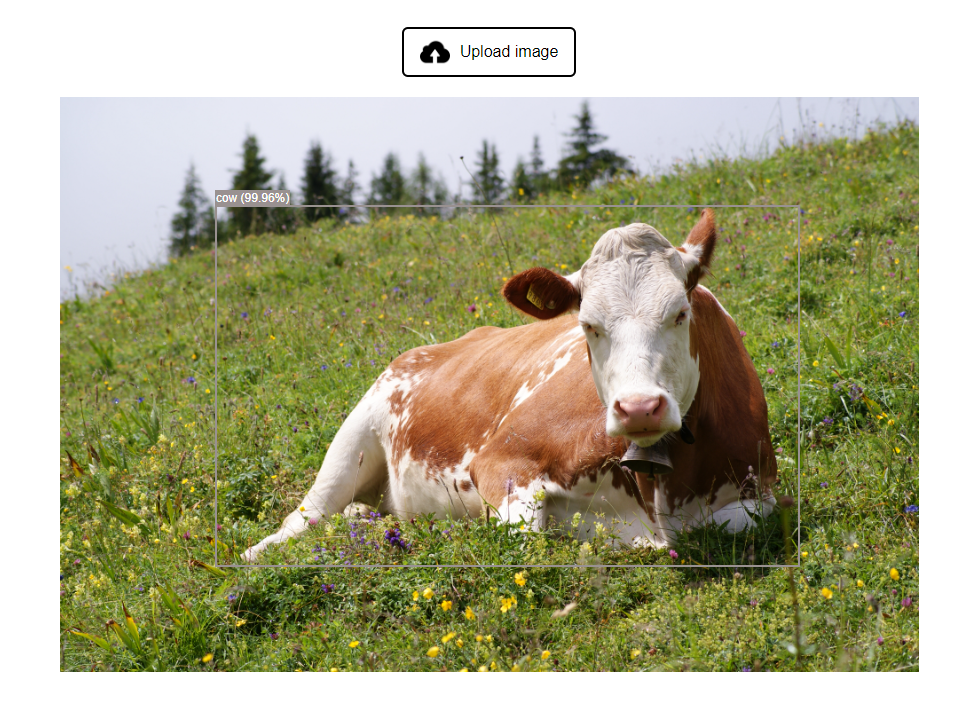

# Object Detection

This project enables easy object detection on uploaded images using Vanilla JavaScript and the Xenova Transformers library. Ideal for beginners or anyone interested in exploring object detection in a simple, browser-based setup.


## Run Locally

Clone the project

```bash
  git clone https://link-to-project
```

Go to the project directory

```bash
  cd my-project
```
Install all the dependencies

```bash
  npm install
```

Start the local server using http-server 

```bash
  http-server
```


## Demo




## Acknowledgements

 - [ChatGPT](https://chat.openai.com/)

